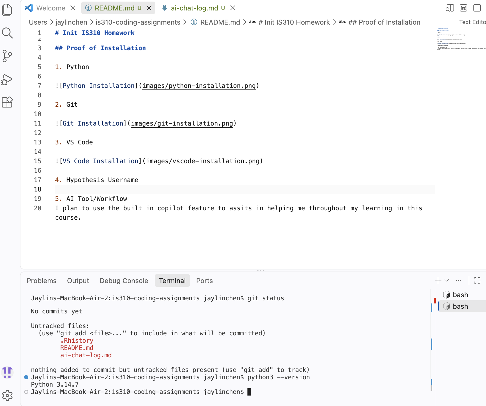
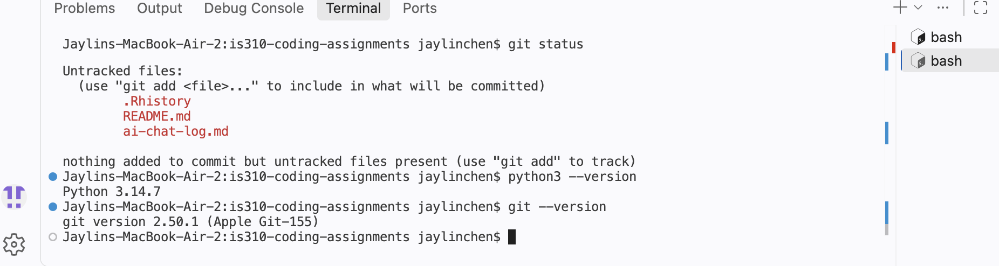
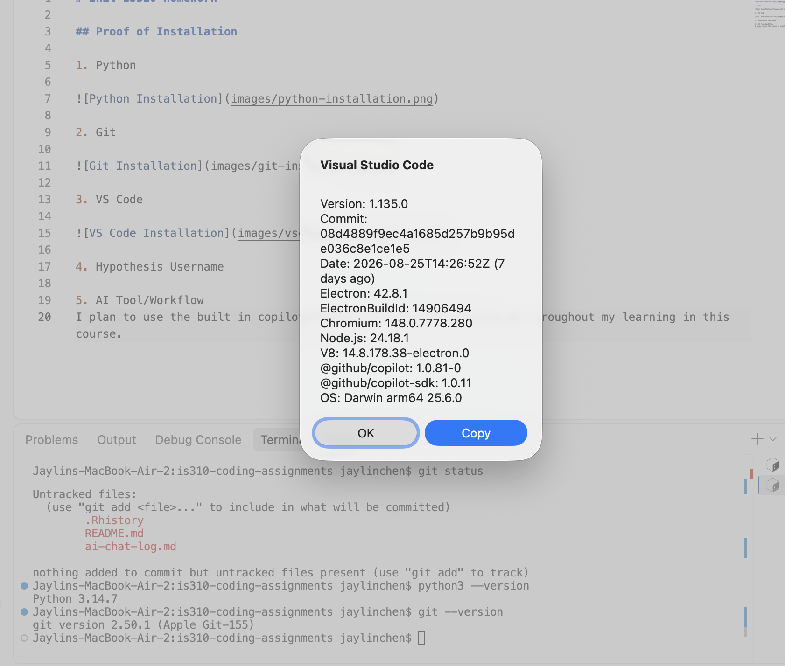

# Init IS310 Homework

## Proof of Installation

1. Python

2. Git

3. VS Code

4. Hypothesis Username
My Hypothesis username: JaylinChen

5. AI Tool/Workflow
I plan to use the built in copilot feature to assits in helping me throughout my learning in this course. 