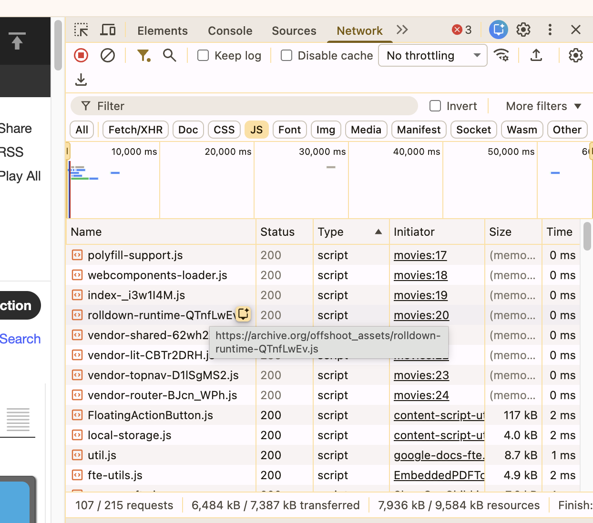
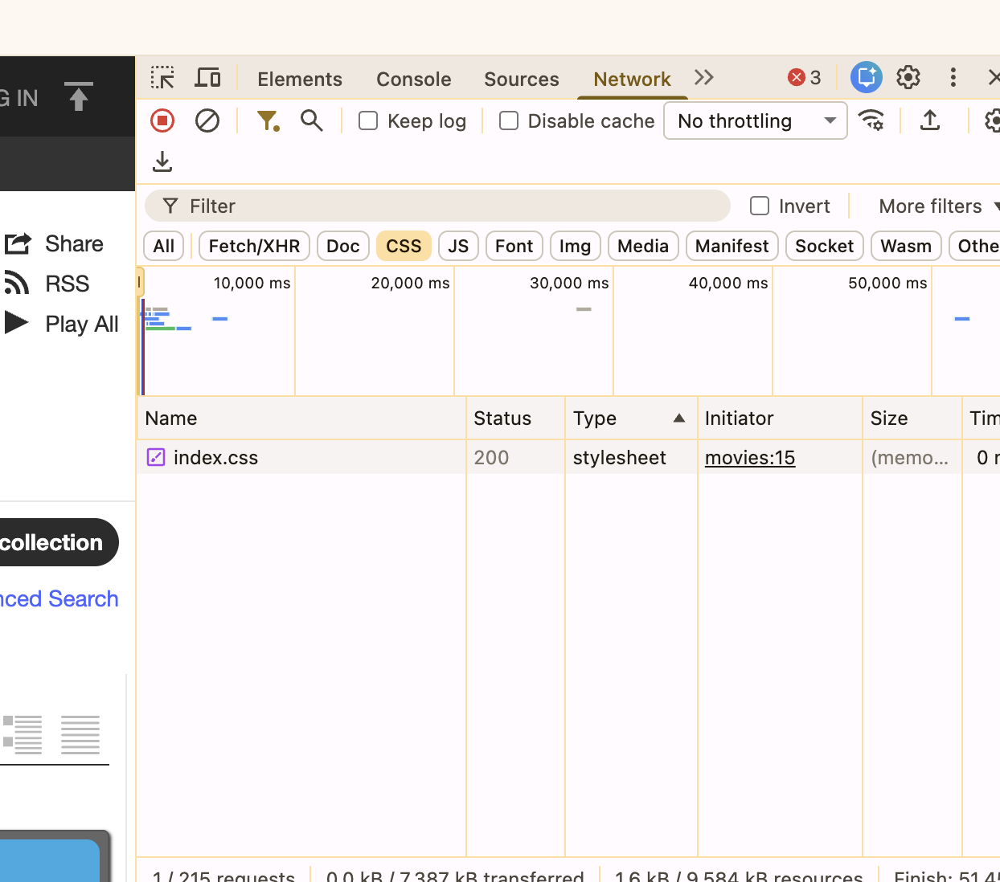
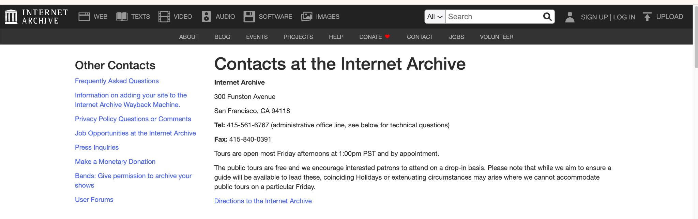

# Source and Style Assignment

## Assignment 1

For this assignment, I inspected the Internet Archive Movies website.

Website URL: [https://archive.org/details/movies](https://archive.org/details/movies)

The Internet Archive Movies collection contains a wide range of 
digital versions of movies, television programs, advertisements, 
animation, and other videos. I chose this website because it was a 
good example of how movies and other cultural digital materials 
can saved and made available to anyone online.

## Web Technologies

Through the Inspect tool in Google Chrome, I looked at how the 
Internet Archive website was built.

This website uses HTML to arrange the content on each individual page. 
In the Network tab, I also found files with the `text/html` type. These files organize all the text, images, links, and different 
sections within the web.

The website also uses CSS to control its appearance. I found a file called `index.css`. Using CSS allows you to controls features such 
as the fonts, colors, spacing, and the overall layout of each page.

I also found tons of JavaScript files, including `polyfill-support.js`, `webcomponents-loader.js`, and `index.js`. In the website, 
JavaScript is used to make the website interactable and help support features such as searching, filtering, menus, and loadingits 
content. There were also PNG and JPEG image files, which is used for make the movie thumbnails, icons, and images appear.

## Screenshots Downbelow

## Who Built the Website?

The website was built and is maintained by the Internet Archive. The Internet Archive is a nonprofit digital library founded by Brewster 
Kahle in 1996. Its overall goal is to preserve digital materials and provide access to the public..

While it doesn't say who the website was built by on the contacts. It does seem to be have made by a large collaborative group such as 
developers, archivists, designers, and other. I can assume this because the Internet Archive runs multiple large digital collections. 

I could not find the exact number of people who worked specifically on the Movies page, but the number of projects and contributors connected to the Internet Archive shows that the website was created and maintained by a team.

## Contacts

The Internet Archive does not have a github listed within the webpage, but there is a contact page with their address, phone number, fax number, and links questions.

[Internet Archive Contact Page](https://archive.org/about/contact.php)

